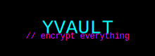

/\ \  _ \ \   /\  __ \   /\ \       /\ \       /\  \   /\ \   /\  == 
\ \ / ".\ \  \ \  __ \  \ \ _  \ \ ____  \ ___  \  \ \ \  \ \  < \ _/".~_\  \ _\ _\  \ _\  \ _\  /_\  \ _\  \ _\ _
//   //   ///_/   //   //   /___/   //   // /_/

Y V A U L T   |   e n c r y p t . a n d . o w n

<p align="center">
  
</p>

---

## ⚡ FEATURES

- Set a secure master password (encrypted, not stored)
- Add / View / Edit / Delete saved login credentials
- AES-256 encryption via CryptoJS
- Offline-first: all data stays on your device
- Local password recovery using security questions
- Cyberpunk / hacker terminal-style interface
- No server. No tracking. No nonsense.

---

## 🧪 TECH STACK

- `HTML5`  
- `CSS3` (dark theme + neon animations)  
- `JavaScript (Vanilla)`  
- `CryptoJS` for encryption  
- `GitHub Pages` for zero-cost deployment  

---

## 🚀 DEMO

Access the live app here:  
**[https://ninja.github.io/yvault/](https://ninja.github.io/yvault/)**

> Works best on modern browsers with JavaScript enabled.

---

## ⚠️ SECURITY NOTES

- Everything is stored in `localStorage` — your data stays **in your browser**.
- The master password is hashed using PBKDF2 with a salt.
- Vault entries are AES-encrypted with your password key.
- If you forget both your master password **and** your recovery answers:  
  **Game over. Vault data is unrecoverable.**

---

## ⛓️ SETUP (FOR HACKERS)

Clone and run it locally:

```bash
git clone https://github.com/Ninja/yvault.git
cd yvault
# Just open index.html in your browser

No build tools. No dependencies. Just static files.


---

☠️ KNOWN LIMITATIONS

No sync or cloud backup

Only works in one browser/device

UI built for fun, not perfection

No password generation (yet)


---

💀 FUTURE PLANS

Add search/filter to entries

Import/export encrypted vault backups

Password strength meter

Custom themes: CRT, Plasma, Terminal Green


---

LICENSE

MIT License — use it, fork it, break it, improve it.

> Welcome to the vault. Guard your secrets well.


---
